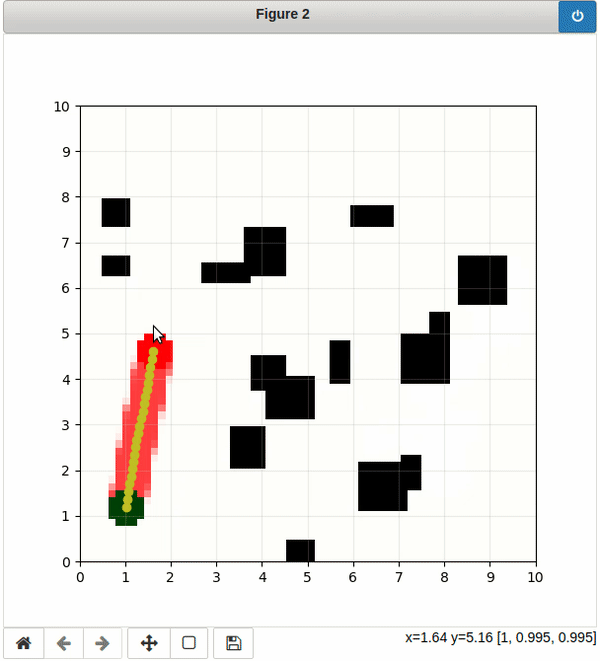

# TUM - Advanced Deep Learning for Robotics
This repository contains the project source code of our team ([@rajk853](https://github.com/rajk853), [@saif61](https://github.com/saif61)) for the TUM - Advanced Deep Learning for Robotics SS21 course.

## Objective
In this project, we will investigate the Supervised Learning (SL) approach in the Neural Motion Planning (NMP). As [T. Jurgenson and A. Tamar, 2019](https://arxiv.org/abs/1906.00214) claims that  
>supervised learning approaches are inferior in their accuracy due to insufficient data on the boundary of the obstacles, an issue that RL methods mitigate by actively exploring the domain  

So in our project, we will investigate the Image-to-Image and Image-to-Coordinate approaches for NMP using SL.


## Setup
1. Install [Conda](https://docs.anaconda.com/anaconda/install/linux/)
2. Clone this repository
```shell
git clone https://github.com/RajK853/tum-adlr-ss21-11.git ~/adlr
```
3. Create and activate conda environment with following command  
```shell
cd ~/adlr
conda env create -f environment.yml
conda activate adlr
```

## Usage



[](https://mybinder.org/v2/gh/RajK853/tum-adlr-ss21-11.git/HEAD?filepath=notebook%2FInteractive_Plot.ipynb)


### Demo plot
> Open as an [notebook](notebook/Demo_plot.ipynb).

Execute the given command where `${PATH_TO_DB_FILE}` is the location of the `.db` file in your local machine.
```shell
python demo_plot.py ${PATH_TO_DB_FILE}
```

### Train U-DenseNet
- Set the database path environment variable `DB_PATH`:
  ```shell
  export DB_PATH=${PATH_TO_DB_FILE}
  ```
- Create a YAML config file (for eg `focal.yaml`) 
  ```YAML
  Focal:
    epochs: 30
    log_dir: results
    batch_size: 64
    path_row_config:
      train: [0, 3000000, 200]
      validation: [3000000, 4000000, 100]
      test:  [4000000, 4100000, 250]
    model_config:
      lr: 0.001
      input_shape: [64, 64, 2]
      num_db: 7                 # Total number of Dense blocks
      convs_per_db: 2           # Convolutional blocks per Dense block
      growth_rate: 16           # Growth rate of the DenseNet
      num_channels: 16          # Number of channels in the first Transition block
    loss_config:
      name: focal
      gamma: 2
      beta: 1.5
  ```

  > Sample configuration files are available [here](/configs)
- Execute the python script:
  ```shell
  python train_image2image_model.py focal.yaml
  ```
  > Try it in [colab](notebook/Console.ipynb).

From each model training session, following components are logged in the `results` directory:
1. **model.tf**: Trained model as `.tf` format
2. **tb_logs**: Tensorboard log information
3. **test_images**: Images with model predictions on the test data set
4. **model.png**: `PNG` image of the model architecture graph 

---
